# 🚀 Cloud & DevOps Learning Journey

[](https://github.com)
[](LICENSE)
[](https://github.com)

> A comprehensive, hands-on learning repository documenting my journey from DevOps fundamentals to advanced cloud engineering, containerization, orchestration, and MLOps.

## 📋 Table of Contents

- [About This Repository](#about-this-repository)
- [Learning Path](#learning-path)
- [Repository Structure](#repository-structure)
- [Technologies & Tools](#technologies--tools)
- [Progress Tracker](#progress-tracker)
- [How to Use This Repository](#how-to-use-this-repository)
- [Resources](#resources)
- [Contributing](#contributing)
- [Connect With Me](#connect-with-me)

## 🎯 About This Repository

This repository serves as a **living documentation** of my DevOps and Cloud Engineering learning journey. It contains:

- **Day-wise learning notes** with detailed explanations
- **Hands-on projects** demonstrating real-world implementations
- **Code snippets and scripts** for automation and deployment
- **Learnings & failures** documenting mistakes and how I overcame them
- **Handwritten notes** for visual learners (PDFs)
- **Best practices** and industry-standard approaches

### 🎓 Learning Philosophy

- **Learn by Doing**: Every concept is backed by hands-on practice
- **Document Everything**: Capture failures, insights, and solutions
- **Build Real Projects**: Focus on practical, production-ready implementations
- **Community Learning**: Share knowledge and learn from others

## 🛤️ Learning Path

```mermaid
graph LR
    A[DevOps Core] --> B[Prerequisites]
    B --> C[Linux]
    C --> D[Shell Scripting]
    D --> E[Networking]
    E --> F[Python]
    F --> G[AWS Cloud]
    G --> H[Docker]
    H --> I[Kubernetes]
    I --> J[CI/CD]
    J --> K[Terraform]
    K --> L[Ansible]
    L --> M[MLOps]
```



## 📁 Repository Structure

```
CLOUD_DEVOPS_JOURNEY/
│
├── 00-devops-core/              # DevOps fundamentals and lifecycle
│   ├── days/
│   ├── handwritten-notes/
│   └── learnings.md
│
├── 01-prerequisites/            # Core prerequisites (Linux, Git, Cloud basics)
│   ├── handwritten-notes/
│   └── learnings.md
│
├── 02-linux/                    # Linux administration and CLI
│   ├── days/                    # Day-wise learning
│   ├── hands-on/                # Commands & labs
│   ├── projects/                # Mini projects
│   ├── handwritten-notes/
│   └── learnings.md
│
├── 03-shell-scripting/          # Bash automation
│   ├── days/
│   ├── projects/
│   ├── handwritten-notes/
│   └── learnings.md
│
├── 04-networking/               # Network fundamentals
│   ├── days/
│   ├── projects/
│   ├── handwritten-notes/
│   └── learnings.md
│
├── 05-python/                   # Python for DevOps
│   ├── days/
│   ├── projects/
│   ├── handwritten-notes/
│   └── learnings.md
│
├── 06-cloud-aws/                # AWS Cloud services
│   ├── days/
│   ├── projects/
│   ├── handwritten-notes/
│   └── learnings.md
│
├── 07-docker/                   # Containerization
│   ├── days/
│   ├── projects/
│   ├── handwritten-notes/
│   └── learnings.md
│
├── 08-kubernetes/               # Container orchestration
│   ├── days/
│   ├── projects/
│   ├── handwritten-notes/
│   └── learnings.md
│
├── 09-ci-cd/                    # Continuous Integration/Deployment
│   ├── days/
│   ├── projects/
│   ├── handwritten-notes/
│   └── learnings.md
│
├── 10-terraform/                # Infrastructure as Code
│   ├── days/
│   ├── projects/
│   ├── handwritten-notes/
│   └── learnings.md
│
├── 11-ansible/                  # Configuration Management
│   ├── days/
│   ├── projects/
│   ├── handwritten-notes/
│   └── learnings.md
│
├── 12-mlops/                    # ML Operations
│   ├── days/
│   ├── projects/
│   ├── handwritten-notes/
│   └── learnings.md
│
└── roadmap/                     # Learning roadmap and strategy
    └── devops-roadmap-digital.md
```

## 🛠️ Technologies & Tools

### Operating Systems & CLI


### Programming Languages


### Cloud Platforms


### Containerization & Orchestration


### CI/CD


### Infrastructure as Code


### Monitoring & Observability


### Version Control


## 📊 Progress Tracker

| Module | Status | Completion | Days | Projects |
|--------|--------|------------|------|----------|
| 00. DevOps Core | 🟡 In Progress | 0% | 0/6 | 0/1 |
| 01. Prerequisites | 🟡 In Progress | 0% | 0/5 | 0/0 |
| 02. Linux | 🔴 Not Started | 0% | 0/6 | 0/1 |
| 03. Shell Scripting | 🔴 Not Started | 0% | 0/4 | 0/1 |
| 04. Networking | 🔴 Not Started | 0% | 0/4 | 0/1 |
| 05. Python | 🔴 Not Started | 0% | 0/3 | 0/1 |
| 06. AWS Cloud | 🔴 Not Started | 0% | 0/4 | 0/1 |
| 07. Docker | 🔴 Not Started | 0% | 0/4 | 0/1 |
| 08. Kubernetes | 🔴 Not Started | 0% | 0/5 | 0/1 |
| 09. CI/CD | 🔴 Not Started | 0% | 0/3 | 0/1 |
| 10. Terraform | 🔴 Not Started | 0% | 0/3 | 0/1 |
| 11. Ansible | 🔴 Not Started | 0% | 0/3 | 0/1 |
| 12. MLOps | 🔴 Not Started | 0% | 0/3 | 0/1 |

**Legend:** 🟢 Completed | 🟡 In Progress | 🔴 Not Started

## 💡 How to Use This Repository

### For Learners

1. **Follow the Sequential Path**: Start from `00-devops-core` and progress through each module
2. **Study Day-wise Notes**: Each module has day-wise breakdown in the `days/` folder
3. **Practice Hands-on**: Complete labs and projects in each section
4. **Review Learnings**: Check `learnings.md` files for common pitfalls and solutions
5. **Build Projects**: Implement the projects to solidify your understanding

### For Recruiters & Hiring Managers

- View **projects/** folders for practical implementations
- Check **learnings.md** to understand problem-solving approach
- Review code quality and documentation standards
- Assess hands-on experience through commit history

### Project Structure Convention

Each module follows this structure:
```
module/
├── README.md              # Module overview and objectives
├── days/                  # Day-wise learning notes
│   ├── day-01-*.md
│   ├── day-02-*.md
│   └── ...
├── hands-on/             # Practice exercises (where applicable)
│   ├── commands.md
│   └── labs.sh
├── projects/             # Real-world projects
│   └── project-name/
│       └── README.md
├── handwritten-notes/    # Handwritten notes (PDFs)
└── learnings.md          # Mistakes, insights, solutions
```

## 📚 Resources

### Official Documentation
- [AWS Documentation](https://docs.aws.amazon.com/)
- [Kubernetes Docs](https://kubernetes.io/docs/)
- [Docker Docs](https://docs.docker.com/)
- [Terraform Docs](https://www.terraform.io/docs)

### Learning Platforms
- [Linux Academy](https://linuxacademy.com/)
- [A Cloud Guru](https://acloudguru.com/)
- [KodeKloud](https://kodekloud.com/)
- [Udemy DevOps Courses](https://www.udemy.com/topic/devops/)

### Community
- [DevOps Subreddit](https://www.reddit.com/r/devops/)
- [Kubernetes Slack](https://slack.k8s.io/)
- [AWS Forums](https://forums.aws.amazon.com/)

## 🤝 Contributing

While this is a personal learning repository, I welcome:

- **Suggestions** for improvements
- **Bug fixes** in code examples
- **Additional resources** and references
- **Best practice recommendations**

Please open an issue or submit a pull request!

## 📝 License

This project is licensed under the MIT License - feel free to use this structure for your own learning journey!

## 🌟 Acknowledgments

- DevOps community for invaluable resources
- Open-source projects that make learning accessible
- Content creators who share their knowledge

## 📬 Connect With Me

- **GitHub**: [Tejas-Santosh-Nalawade](https://github.com/Tejas-Santosh-Nalawade)
- **LinkedIn**: [Tejas Nalawade](https://www.linkedin.com/in/tejas-nalawade/)
- **Email**: tejassantoshnalawade@gmail.com

---

<div align="center">

### ⭐ If you find this repository helpful, please consider giving it a star!

**"The journey of a thousand miles begins with a single step"** - Lao Tzu

Made with ❤️ for Cloud and DevOps Community

</div>
